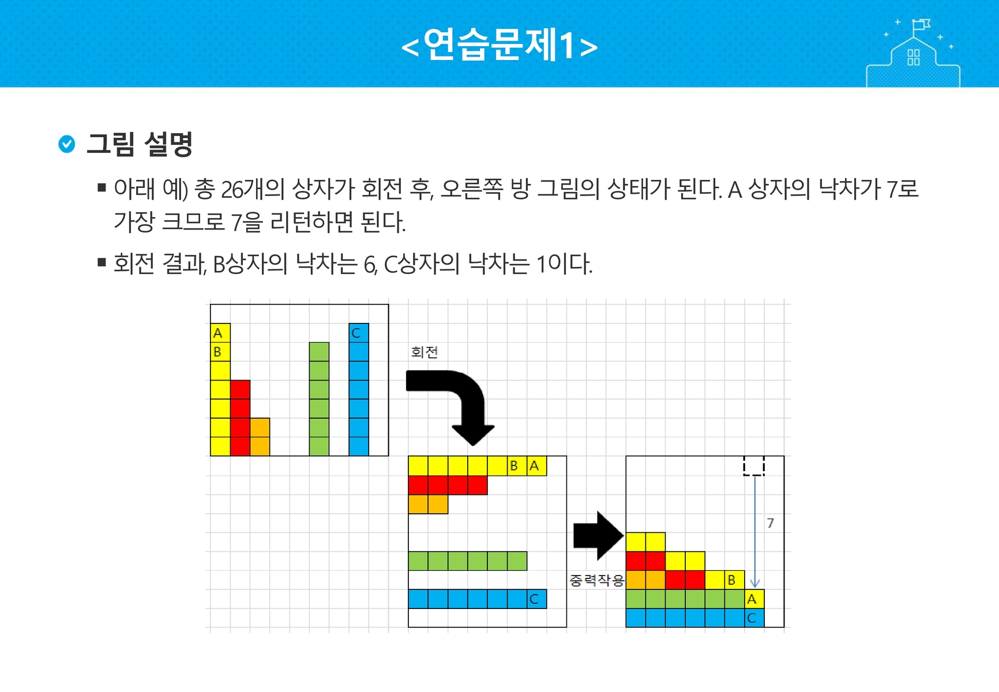
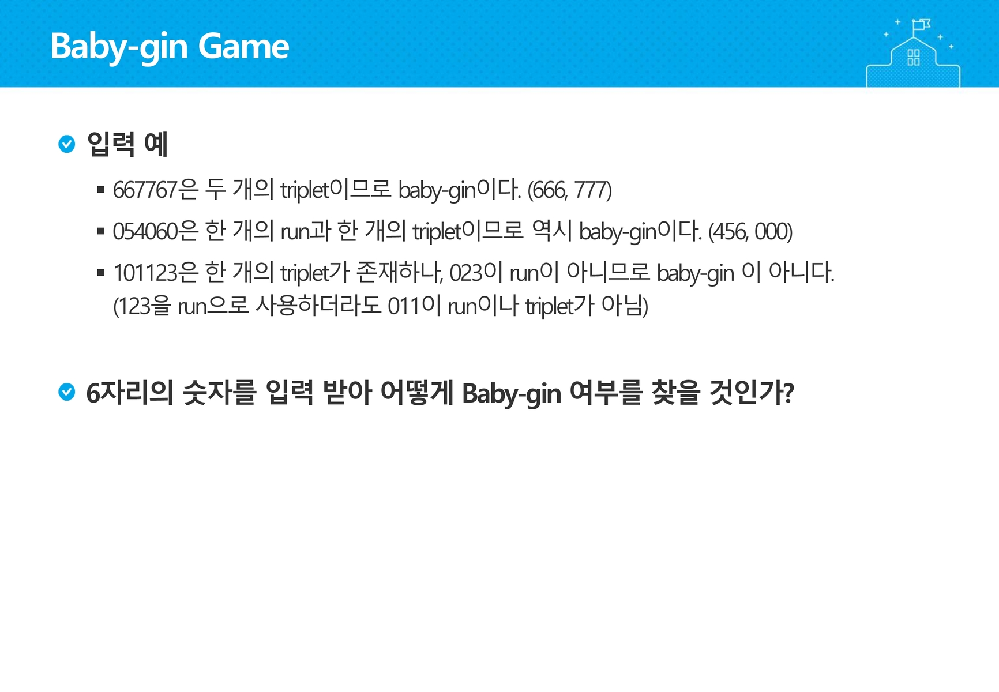

[TOC]


# SWEA 문제 풀이

github.com/pyjune/ssa2 알고리즘 강사님 깃헙 페이지

4835. [파이썬 S/W 문제해결 기본] 1일차 - 구간합 D2

길이가 M인 구간의 시작 인덱스 i의 범위


M = 3인 경우,

i : 0 -> N-3 => i : 0 -> N-M


M개를 더하는 구간

j : 0 -> M-1

maxS = 0

minS = 10000*M or 1000000

for i : 0 -> N-M

​			s=0

​			for j : 0 -> M-1

​							s = s + A[i + j]

​			if maxS < s

​							maxS = s

​			if minS > s

​							minS = s

print(maxS-minS)


4831. [파이썬 S/W 문제해결 기본] 1일차 - 전기버스 D3

      방전될 때까지 이동

      충전기가 없는 경우 가능한 가장 먼 충전기로 이동

      

      [충전기의 위치를 저장하는 방법 결정]

      1, 3, 5, 7, 9에 있다면

      

      1.정류장 번호를 인덱스로 한 배열에 충전기의 위치만 표시

      stop[] = {0, 1, 0, 1...}

      

      2.충전기 위치만 저장(0번에서는 항상 충전할 수 있음)

      stop[] = {1, 3, 5, 7, 9} 또는 stop [] = {0, 1, 3, 5, 7, 9}

      

      [방법1]

      stop [] = {0, 1, 3, 5, 7, 9}

      i번 충전기에 도착할 수 있는지 확인 - stop[1] ~ stop[M]

      마지막 충전 위치: last = 0

      stop[i] - stop[last] <= K: i에 도착 가능

      

      stop[i] - stop[last]

      stop[1] - stop[0] -> 1 <= 3, 가능하면 i 증가

      stop[2] - stop[0] -> 3 <= 3

      stop[3] - stop[0] -> 5 <= 3, 이동 불가능. last = 2(이전 충전기)

      ​														충전횟수 1 증가

      stop[4] - stop[2] -> 4 < = 3, 이동 불가능. last = 3(i-1)

      ​														충전횟수 1 증가

      ...

      처음부터 종점을 포함해 도착 가능 여부를 확인하면

      stop [] = {0, 1, 3, 5, 7, 9, 10}

      

      [방법2]

      stop [] = {0, 1, 0, 1...}

      (1) 현재 위치 i에서 i+K로 이동

      (2) 충전기가 없으면 충전, 현재 위치를 i로 바꾸고 (1) 반복

      (3) 충전기가 없으면 i+K에서 충전기가 나올 때 까지 -1씩 이동

      => i까지 감소하기 전에 충전기가 나오면 (2)를 실행

      => i가 되면 진행불가

      

      ### 1206. [S/W 문제해결 기본] 1일차 - View

      [문제 내용](https://swexpertacademy.com/main/solvingProblem/solvingProblem.do#collapseOne)

      - 시간 : 10개 테스트케이스를 합쳐서 *C++의 경우 10초* / *Java의 경우 20초* / *Python의 경우 30초*
      - 메모리 : 힙, 정적 메모리 합쳐서 *256MB* 이내, 스택 메모리 *1MB* 이내

      

      **※ SW Expert 아카데미의 문제를 무단 복제하는 것을 금지합니다.**

      강변에 빌딩들이 옆으로 빽빽하게 밀집한 지역이 있다.

      이곳에서는 빌딩들이 너무 좌우로 밀집하여, 강에 대한 조망은 모든 세대에서 좋지만 왼쪽 또는 오른쪽 창문을 열었을 때 바로 앞에 옆 건물이 보이는 경우가 허다하였다.

      그래서 이 지역에서는 왼쪽과 오른쪽으로 창문을 열었을 때, 양쪽 모두 거리 2 이상의 공간이 확보될 때 조망권이 확보된다고 말한다.

      빌딩들에 대한 정보가 주어질 때, 조망권이 확보된 세대의 수를 반환하는 프로그램을 작성하시오.
      
      아래와 같이 강변에 8채의 빌딩이 있을 때, 연두색으로 색칠된 여섯 세대에서는 좌우로 2칸 이상의 공백이 존재하므로 조망권이 확보된다. 따라서 답은 6이 된다.

      

      
      A와 B로 표시된 세대의 경우는 왼쪽 조망은 2칸 이상 확보가 되었지만 오른쪽 조망은 한 칸 밖에 확보가 되지 않으므로 조망권을 확보하지 못하였다.

      C의 경우는 반대로 오른쪽 조망은 2칸이 확보가 되었지만 왼쪽 조망이 한 칸 밖에 확보되지 않았다.
      
      **[제약 사항]**

      가로 길이는 항상 1000이하로 주어진다.

      맨 왼쪽 두 칸과 맨 오른쪽 두 칸에는 건물이 지어지지 않는다. (예시에서 빨간색 땅 부분)

      각 빌딩의 높이는 최대 255이다.
      
      **[입력]**

      입력 파일의 첫 번째 줄에는 테스트케이스의 길이가 주어진다. 그 바로 다음 줄에 테스트 케이스가 주어진다.

      총 10개의 테스트케이스가 주어진다.

      ```python
      def GetMax(i):
          max_floor = floor[i-2]
          if max_floor < floor[i-1]:
              max_floor = floor[i-1]
          if max_floor < floor[i+1]:
              max_floor = floor[i+1]
          if max_floor < floor[i+2]:
              max_floor = floor[i+2]
      
          return max_floor
      
      TC = 10
      for tc in range(1, TC+1):
          N = int(input())
          floor = list(map(int, input().split()))
          result = 0
      
          for i in range(2, N-2):
              side = GetMax(i)
              if side < floor[i]:
                  result += floor[i] - side
      
          print(f'#{tc} {result}')
      ```

      

      

      ## 1차원 배열

      **1차원 배열의 선언**

      

      Arr = list() 

      Arr[]

      

      **1차원 배열의 접근**

      

      

      

      ## 배열 활용 예제 : Gravity

      - 상자들이 쌓여있는 방이 있다. 방이 오른쪽으로 90도 회전하여 상자들이 중력의 영향을 받아 낙하한다고 할 때, 낙차가 가장 큰 상자를 구하여 그 낙차를 리턴 하는 프로그램을 작성하시오.
      - 중력은 회전이 완료된 후 적용된다.
      - 상자들은 모두 한쪽 벽병에 붙여진 상태로 쌓여 2차원의 형태를 이루며 벽에서 떨어져서 쌓인 상자는 없다.
      - 방의 가로길이는 항상 100이며, 세로 길이도 항상 100이다.
      - 즉, 상자는 최소 0, 최대 100 높이로 쌓을 수 있다.

      ```python
      def build_data(data):
          for i in range(0, 100)
          	data[i]
              
      if __name__ == "__main__" :
          int data[100];
          for i in range(0, 100)
          	build_data(data)
              
              print(result)
      ```

      

      Baby-gin Game

      

      ```python
      
      ```

      

      **완전 검색**

      

      문제의 해법으로 생각할 수 있는 모든 경우의 수를 나열해보고 확인하는 기법이다.

      

      Brute-force, generate and test 기법

      

      탐욕 알고리즘 :  최적 해를 구하는 데 사용되는 근시안적인 방법

      

      거스름돈 줄이기

      ```python
      
      ```

      

      

      

      

      

      

      

      